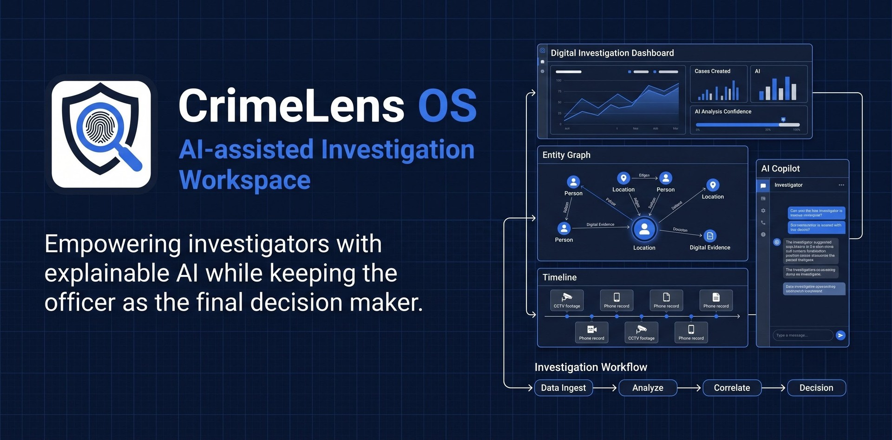

# CrimeLens OS




**AI-assisted Investigation Workspace for Karnataka State Police**  
*SCRB Investigation Platform Prototype*

---

> **"The AI assists. The officer decides."**

> **AI Disclaimer**: CrimeLens OS provides AI-assisted investigation support. Final investigative decisions remain with authorized law enforcement officers.

---

## 🌐 Live Demo & Deployment

CrimeLens OS is deployed and active in production:

- **Live Web Application**: [https://crimelens-os.onslate.in](https://crimelens-os.onslate.in)
- **Demo Video**: [Watch Demo Video](https://crimelens-os.onslate.in)
- **Web Hosting**: Zoho Catalyst Slate (Production Web Distribution)
- **Continuous Deployment**: Auto-deployed directly from GitHub `main` branch
- **Serverless AI Backend**: Powered by Zoho Catalyst Serverless HTTP Function (`geminiProxy`)

---

## Problem Statement

**Karnataka State Police (KSP) Datathon 2026 — Challenge 1: AI-Assisted Investigation Workspace**

Karnataka State Police investigators handle a high volume of complaints — especially cybercrime cases involving digital fraud, UPI scams, and online impersonation. Officers must rapidly:

- Extract structured evidence from unstructured complaint narratives
- Identify patterns across multiple cases
- Reconstruct chronological timelines
- Match against historical SCRB case studies
- Generate investigation strategies with supporting legal precedents

Currently, this work is manual, time-consuming, and dependent on individual officer experience. CrimeLens OS provides a structured AI-assisted workspace to accelerate and standardize this process.

---

## Solution

CrimeLens OS provides a complete AI-assisted investigation workflow:

```
Complaint Intake
     ↓
Entity Extraction
(Names, Phones, UPI IDs, Bank Accounts, Vehicles, Locations)
     ↓
Timeline Reconstruction
(Chronological event sequencing with gap and conflict detection)
     ↓
SCRB Investigation Memory
(Similarity matching against 10 structured historical case studies)
     ↓
Contradiction Detection
(Cross-case anomaly identification)
     ↓
Modus Operandi Analysis
(Pattern matching against known crime MO profiles)
     ↓
Strategy Generation
(Immediate actions, leads, evidence priorities)
     ↓
Copilot Assistance
(Natural language Q&A in English and Kannada with offline resilience)
     ↓
Investigation Brief
(PDF report with full evidence, strategy, and reasoning trace)
     ↓
Officer Decision
(The AI advises. The officer remains the final decision maker.)
```

---

## Architecture

### End-to-End Deployment & AI Flow Architecture

```
React (Slate)
     │
     ▼
Catalyst Serverless (geminiProxy)
     │
     ├── Google Gemini API
     └── Offline Rule-Based Engine
```

Detailed Flow:

```
User / Officer (Browser)
      │
      ▼
React + Vite Frontend (CrimeLens OS Client)
      │
      ▼
Zoho Catalyst Slate (Production Web Hosting)
      │
      │ POST /server/geminiProxy
      ▼
Catalyst Serverless Function (geminiProxy)
   [Securely reads: process.env.GEMINI_API_KEY]
      │
      ├───► Live API Request ──► Google Gemini API ──► Structured JSON Response
      │
      └───► Fallback Engine (If API key offline / rate-limited) ──► Rule-Based Advisory Engine
```

#### Architectural Layers Explained:
- **React Frontend**: Client application running in the browser. Renders the interactive workspace, timeline visualizations, and entity graph. Never exposes the Gemini API key.
- **Zoho Catalyst Slate**: Production web application hosting platform for CrimeLens OS, auto-deploying updates from GitHub.
- **Catalyst Serverless Function (`geminiProxy`)**: Node.js Express Advanced I/O HTTP function that acts as a secure API gateway between CrimeLens OS and Google Gemini.
- **Google Gemini API**: Cognitive AI engine providing structured entity extraction and bilingual copilot assistance.
- **Offline Fallback Engine**: If cloud AI is unreachable or rate-limited, CrimeLens OS automatically switches to built-in regex entity extraction and rule-based copilot Q&A without breaking the user experience.

### AI Reliability

CrimeLens OS automatically switches to its built-in rule-based advisory engine whenever the Gemini API is unavailable or rate-limited, ensuring uninterrupted investigation support for officers in any network condition.

---

## Features

| Module | Description |
|---|---|
| **Case File Registry** | Create, view, and manage multiple concurrent case files |
| **AI Extraction** | Live Google Gemini API via `geminiProxy` serverless function or built-in regex parser (offline) |
| **Offline Rule-Based Copilot** | Automatic fallback engine providing instant advisory responses when cloud AI is unavailable |
| **Explainable AI (XAI)** | AI responses include step-by-step reasoning, evidence references, confidence level, audit trail, and recommended next actions |
| **Entity Network Graph** | Interactive SVG graph — zoom, pan, filter by entity type |
| **Timeline Flow** | Chronological reconstruction with gap detection and conflict highlighting |
| **SCRB Investigation Memory** | Similarity-scored retrieval from 10 curated historical case studies |
| **Contradiction Engine** | Cross-case anomaly and timeline conflict identification |
| **Modus Operandi Engine** | MO pattern matching against known crime profiles |
| **AI Question Generator** | Context-specific investigation questions for officer-led interviews |
| **Strategy Engine** | Prioritized investigation roadmap with legal SOP alignment |
| **Legal Guidance** | Applicable IPC/BNS & IT Act sections and precedents from curated knowledge base |
| **Police Knowledge Base** | SCRB-curated SOPs and guidelines per crime type |
| **Reasoning Core** | Multi-module inference engine with evidence trace and confidence scoring |
| **Hypothesis Board** | Structured hypothesis testing workspace |
| **Confidence Map** | 7-facet evidence coverage assessment |
| **Copilot** | Conversational AI assistant — English and Kannada |
| **Voice Interface** | Browser Speech Recognition + Speech Synthesis |
| **Investigation Replay** | Step-by-step case reconstruction viewer |
| **Command Center** | Live investigation health metrics strip |
| **PDF Generator** | Comprehensive investigation brief with disclaimer |
| **Audit Trail** | Chronological officer activity log |
| **Demo Mode** | Fully pre-loaded sandbox with 11 demo cases across 7 Karnataka districts |

---

## Technology Stack

| Layer | Technology |
|---|---|
| **Frontend Framework** | React 19 |
| **Build Tool** | Vite 8 |
| **Styling** | Tailwind CSS v4 |
| **Web Hosting** | Zoho Catalyst Slate |
| **Serverless Backend** | Zoho Catalyst Serverless Functions (`geminiProxy` - Node 18 Express) |
| **AI Engine (Live)** | Google Gemini API (accessed via `geminiProxy` serverless HTTP function) |
| **AI Fallback (Offline)** | Rule-based decision tree & regex entity parser |
| **Icons** | Lucide React |
| **Charts** | Recharts |
| **PDF Generation** | jsPDF + html2canvas |
| **State Management** | React Context API (`CaseProvider`) |
| **Persistence** | Browser localStorage + Catalyst Data Store sync |
| **Speech** | Web Speech API (native browser) |
| **Fonts** | Google Fonts — Outfit, Inter |

---

## Zoho Catalyst Services Used

CrimeLens OS is built natively on the Zoho Catalyst serverless cloud ecosystem:

- **Catalyst Slate**: Production web hosting and static asset distribution environment.
- **Catalyst Serverless Functions (`geminiProxy`)**: Node.js Express Advanced I/O HTTP Function mounted at `/server/geminiProxy`, securely bridging the frontend with Google Gemini API.
- **Catalyst Data Store (`Crime_OS`)**: Relational backend storage integration for syncing investigation records.
- **Catalyst Authentication**: User management and role-based officer access control.
- **Catalyst Logs**: Function execution metrics, health logging, and monitoring.

---

## Security

CrimeLens OS implements strict security best practices for law enforcement software:

- **Gemini API key stored securely in Catalyst Environment Variables**: The key is kept strictly on the backend.
- **No API keys exposed to the frontend**: Client JavaScript bundle contains zero secrets or tokens.
- **Secure Serverless Proxy**: All AI communication passes through the secure `geminiProxy` serverless function.
- **Offline Resilience**: Built-in regex and rule-based fallback engines allow full offline functionality without cloud dependencies.
- **Clean Repository**: No credentials, tokens, or environment files are committed to GitHub.

---

## Folder Structure

```
CrimeLens-OS/
├── public/                     # Static assets (favicons, banners, splash screens, OG image)
├── functions/                  # Zoho Catalyst Serverless Functions
│   └── geminiProxy/            # Serverless HTTP API proxy for Gemini API
│       ├── catalyst-config.json # Function configuration (node18, advancedio)
│       ├── index.js            # Express router handling /extract, /copilot, /health
│       └── package.json        # Function dependencies
│
├── src/
│   ├── App.jsx                 # Main application workspace and tab routing
│   ├── main.jsx                # React entry point
│   ├── index.css               # Enterprise theme styling
│   │
│   ├── components/
│   │   └── Visualizations.jsx  # Timeline, Entity Graph, Money Flow, Heatmap
│   │
│   ├── services/
│   │   ├── caseStore.jsx        # Global case state (React Context) with 11 demo cases
│   │   ├── storage.js           # localStorage & Data Store CRUD
│   │   ├── gemini.js            # Calls /server/geminiProxy with regex fallback
│   │   ├── scrbRepository.js    # SCRB Memory, Strategy, Questions, Contradictions
│   │   ├── investigationMemory.js # Case memory persistence + similarity scoring
│   │   ├── copilotService.js    # Calls /server/geminiProxy with rule-based fallback
│   │   ├── knowledgeEngine.js   # Police guidelines + legal precedents
│   │   ├── reasoningCore.js     # Multi-module reasoning engine
│   │   ├── investigationCore.js # Investigation workflow engine
│   │   ├── commandCore.js       # Command Center metrics
│   │   ├── confidenceMapService.js # 7-facet confidence scoring
│   │   ├── investigation.js     # Evidence gaps + similarity scoring
│   │   └── patternDetection.js  # Pattern analysis
│   │
│   └── data/
│       └── demo/               # Demo complaint text files
│
├── .env.example                # Environment variable template
├── catalyst.json               # Catalyst manifest (linking Slate & Functions)
├── index.html                  # HTML entry point with metadata
├── package.json                # Dependencies
├── vite.config.js              # Vite configuration
└── README.md                   # Project documentation
```

---

## Setup & Running Instructions

### Prerequisites
- Node.js ≥ 18
- npm ≥ 9

### Installation

```bash
# Clone the repository
git clone https://github.com/Mappillai-Meeran/CrimeLens-OS.git
cd CrimeLens-OS

# Install dependencies
npm install
```

### Development

```bash
npm run dev
```
Opens at `http://localhost:5173`

### Production Build

```bash
npm run build
```
Output generated in `dist/`

---

## Running CrimeLens OS

### Demo Sandbox Mode

1. Launch the application or visit [https://crimelens-os.onslate.in](https://crimelens-os.onslate.in)
2. Click **"Initialize Demo OS"** on the landing screen
3. The workspace loads with 11 demo cases across 7 Karnataka districts, 10 SCRB memory entries, guidelines, and legal precedents.

### Live Investigation Workflow

1. Click **"New Case"** in the Case File Registry
2. Paste complaint text in the Intake area
3. Click **Extract Evidence** (AI or regex parsing)
4. Navigate tabs: Overview → Analysis → Reasoning → Knowledge → Reports
5. Ask Copilot questions in English or Kannada with audio output enabled.

---

## License & Acknowledgements

Developed for the **Karnataka State Police (KSP) Datathon 2026 — Challenge 1: AI-Assisted Investigation Workspace**.  
Powered by **Zoho Catalyst** and **Google Gemini API**.

Internal use only.

**The AI assists. The officer decides.**
